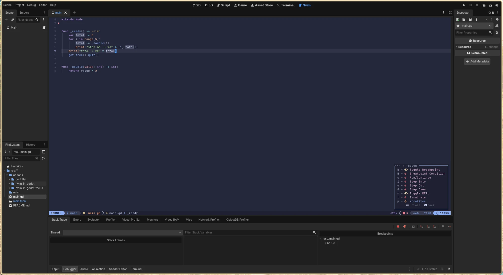
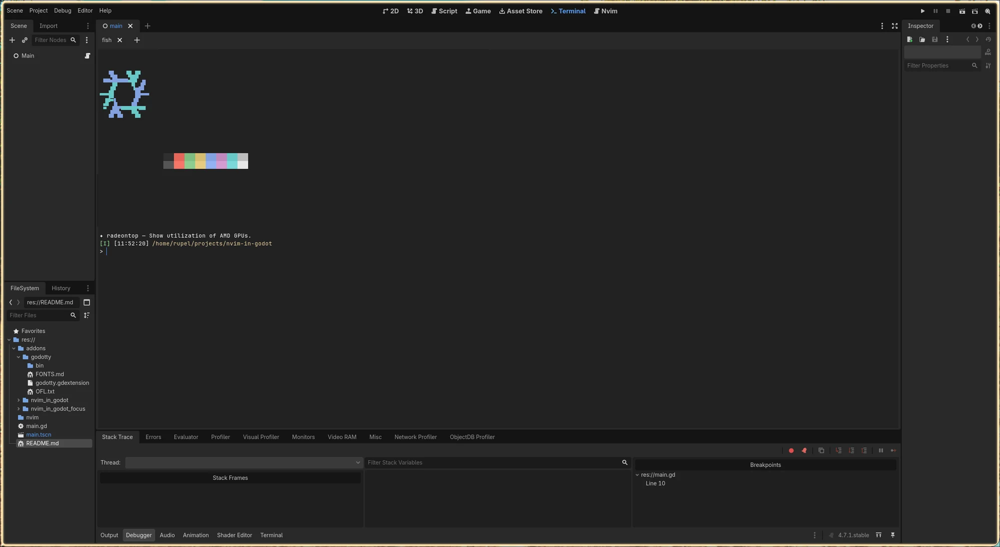
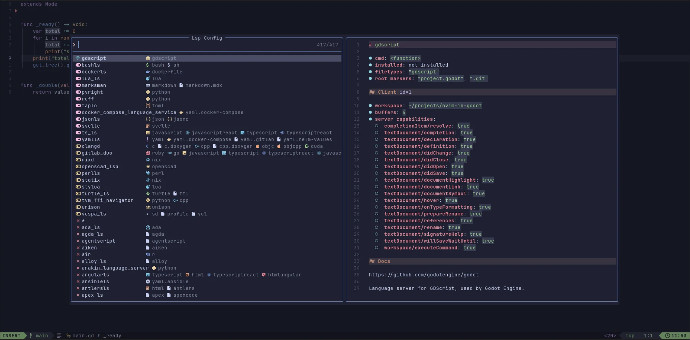
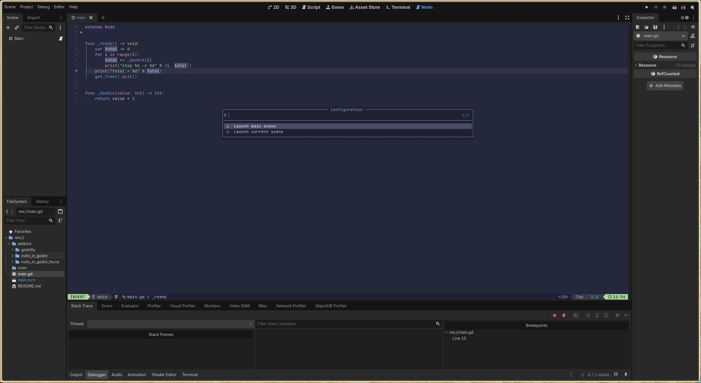

# nvim-in-godot

Neovim as the script editor inside the Godot editor, on a main-screen tab next to
2D / 3D / Script.

This is not a Vim-emulation layer. It runs your real Neovim — your `init.lua`,
your plugins, your colorscheme, your treesitter — in a terminal embedded in the
Godot editor window. Clicking a script in the FileSystem dock opens it in that
Neovim at the right line. Saving it makes Godot reload the script.

It requires no engine patches and runs on stock Godot.



*The **Nvim** tab, selected. Real Neovim in the editor viewport — here with the
`<leader>d` debug menu that [`nvim/godot.lua`](nvim/godot.lua) ships, and Godot's
own Breakpoints dock listing the same file beside it.*

## Requirements

| | |
|---|---|
| Godot | 4.7 or later |
| [Godotty](https://github.com/ingur/godotty) | the embedded terminal; installed separately |
| Neovim | any recent version (0.11+ for the LSP config below) |
| Platform | Linux and macOS. The helper scripts are bash; Windows needs equivalents. |

Godotty does the heavy lifting — it is a Rust GDExtension wrapping ghostty's VT
engine. This project is the plumbing that turns it into a script editor.



*The **Terminal** tab is Godotty's own, not this addon's — a plain shell, to show
the PTY works. This project adds the **Nvim** tab beside it.*

## Installation

**1. Install Godotty.** In the Godot editor, open the AssetLib tab, search for
`Godotty`, install it. It is roughly 110 MB of prebuilt binaries.

**2. Install this addon.** Copy both directories into your project:

```
addons/nvim_in_godot/
addons/nvim_in_godot_focus/
```

**3. Enable both** under *Project → Project Settings → Plugins*. Both are
required; see [How it works](#how-it-works) for why there are two.

**4. Point Godot at the shim.** In *Editor → Editor Settings → Text Editor →
External*:

| Setting | Value |
|---|---|
| Use External Editor | on |
| Exec Path | `<project>/addons/nvim_in_godot/bin/godot-nvim-open` |
| Exec Flags | `{project} {file} {line}` |

The path may point at *any* copy of the shim. It derives the target socket from
the `{project}` argument Godot passes it, so one installation routes correctly
for every project you open. Copy it to `~/.local/bin` if you would rather the
setting not depend on a project directory that might move.

These are global editor settings, so this step is done once, not per project.

**5. For debugging only**, enable *Script → Debug → Debug with External Editor*.

## Usage

Select the **Nvim** tab. Neovim starts in your project root and stays running for
the session. Opening a script from the FileSystem dock brings the tab forward and
jumps to the line.

Neovim receives every keystroke, with three exceptions handed back to Godot:

| Key | Action |
|---|---|
| `F5` | Run project |
| `F6` | Run current scene |
| `F8` | Stop |

These are matched by Godot shortcut path rather than keycode, so rebinding them
in Editor Settings works, as do the macOS defaults (`Cmd+B` / `Cmd+R` / `Cmd+.`).

`Ctrl+S` deliberately reaches Neovim. It writes the buffer, and Godot's
`auto_reload_scripts_on_external_change` (on by default) picks the file back up.

If you `:q`, the tab goes inert; selecting it again starts a fresh Neovim. Three
failures within three seconds stops the automatic restart, so a broken launcher
cannot become a crash loop.

## Neovim setup: LSP and DAP

The Godot editor runs a GDScript language server on `127.0.0.1:6005` and a Debug
Adapter Protocol server on `127.0.0.1:6006`. Both require the editor to be open.

Neither is a standalone process you install — the editor *is* the server, so it
must be open for either half to work.

[`nvim/godot.lua`](nvim/godot.lua) is a ready-made configuration for both.

### With lazy.nvim or LazyVim

Copy it into your plugin directory:

```sh
cp nvim/godot.lua ~/.config/nvim/lua/plugins/godot.lua
```

Then run `:Lazy sync`. It installs `mfussenegger/nvim-dap`, which is not part of
stock LazyVim.

### With another plugin manager

The file returns a lazy.nvim spec, but the substance is two independent pieces
you can lift out:

1. the `gdscript` table under `opts.servers` — a plain `vim.lsp.config()` table —
   together with the supervisor functions defined above it, and its
   `opts.setup.gdscript` hook, which is what arms the server;
2. the body of the `nvim-dap` `config` function, which needs nothing but
   `require("dap")`.

Install `mfussenegger/nvim-dap` through your own manager and run the second piece
after it loads.

### Checking it works

With the Godot editor open on the project, open a `.gd` file and run
`:checkhealth vim.lsp`. A `gdscript` client should be listed, with `Command`
showing a *function reference* rather than a command line — that is what confirms
the TCP path instead of a subprocess.



*`cmd: <function>` is the thing to look for. A command line there would mean
Neovim is supervising a subprocess instead of holding the socket.*

`<leader>cG` forces a reconnect and reports what happened. `:lsp restart gdscript`
restarts the client outright.



*The debug half: `<leader>dc` offers the two configurations
[`nvim/godot.lua`](nvim/godot.lua) defines, so the project runs from Neovim
without touching the editor.*

### What to watch out for

- **The LSP must be given a TCP connection, not a subprocess.** Use
  `cmd = vim.lsp.rpc.connect("127.0.0.1", 6005)`. A common workaround is
  `cmd = { "nc", "localhost", "6005" }`, which makes Neovim supervise a netcat
  process instead of the socket — so socket errors only ever reach Neovim as
  "the process exited", and a Godot restart kills the client ungracefully.
- **Restarting Godot kills the LSP silently.** Neovim sees a clean exit (code 0)
  and does not re-dial. The file includes a supervisor that reconnects on its
  own. It probes the port with raw `vim.uv` TCP before touching `vim.lsp`,
  because a failed dial leaves a half-initialized client that `vim.lsp.start()`
  will happily reuse forever, permanently wedging reconnection.
- **`nvim-dap` needs `scene`, not `launch_scene`.** Godot's DAP parser reads
  `scene` and branches on `"main"` / `"current"` / a `res://` path.
  `launch_scene` is a leftover from the VS Code extension and is ignored.
- **Do not use `project = "${workspaceFolder}"`.** nvim-dap expands it to
  Neovim's cwd, not the project root, and Godot rejects the launch with
  `WRONG_PATH` if you started Neovim from a subdirectory.

Neovim 0.12 ships a built-in `:lsp` command, and nvim-lspconfig skips defining
`:LspInfo` / `:LspRestart` when it is present. Use `:lsp restart gdscript`, or
`:checkhealth vim.lsp`.

## How it works

```
Godot editor (unmodified)
└── addons/nvim_in_godot            main-screen tab
      └── Godotty Terminal          PTY + terminal emulation
            └── nvim --listen <socket>
                        ↑
        addons/nvim_in_godot/bin/godot-nvim-open   ← Godot's exec_path
```

Godot's external-editor setting suppresses the built-in script editor and hands
the file path to an arbitrary command. That command is a shim that forwards the
file to the already-running Neovim over its `--listen` socket, rather than
starting a new one. If no Neovim is listening — a project without this addon —
the shim opens a standalone terminal instead, so scripts never silently fail to
open.

### Why there are two plugins

Godot deliberately skips the workspace switch when an external editor is active,
so without help the script arrives in the Nvim tab while you are still looking at
another one.

The obvious fix — having the main-screen plugin declare `_handles(Script)` —
breaks the whole thing. `EditorData::get_handling_main_editor()` returns exactly
one plugin and iterates backwards so that user addons outrank built-ins, so the
plugin would displace `ScriptEditorPlugin` entirely, `ScriptEditor::edit()` would
never run, and the external editor would never be invoked.

`get_handling_sub_editors()` is additive and collects only plugins *without* a
main screen. `nvim_in_godot_focus` is therefore a screen-less companion that handles
`Script` and runs after the external editor has already been launched. It does
nothing but bring the tab forward.

### Why key handling lives in `_input()`

Godotty's terminal overrides `_gui_input` and calls `accept_event()` on every key
it encodes. Godot's input order is `_input` → GUI input → unhandled input, so
`_shortcut_input` and `_unhandled_key_input` never see a key the terminal has
taken. `_input()` is the only hook that runs first.

Godotty's own `passthrough_shortcuts` setting cannot be used for this: it
requires Ctrl, Alt or Meta to be held, and `F5` carries no modifier.

## Limitations

- **The debugger's "jump to error line" does not switch tabs.** Neovim still
  jumps to the correct line, but you stay on whatever tab you were on.
  `ScriptEditor::edit()` returns `false` on the external path so the plugin hook
  never fires, and there is no public API to observe it.
- **`Use External Editor` is global, the addon is per project.** Projects without
  the addon fall back to opening scripts in a standalone terminal.
- **The LSP supervisor owns enabling `gdscript`.** While Godot is closed the
  config is deliberately disarmed, so `:checkhealth vim.lsp` will not list the
  server at all. A deliberate `:lsp stop gdscript` is undone by the next
  reconnect trigger.
- **Godotty is a per-project dependency** and is not small. Add
  `addons/godotty/` to your project's `.gitignore`.

## Development

The repository root is a Godot project, so it can be opened directly to work on
the addon. `main.tscn` exists only to give the debugger something to launch.

```
addons/nvim_in_godot/        the main-screen plugin and helper scripts
addons/nvim_in_godot_focus/  the companion that switches workspace
nvim/godot.lua               Neovim LSP + DAP configuration
main.gd, main.tscn           a trivial scene for testing the debugger
docs/                        README screenshots; .gdignore keeps the
                             importer out, so they stay plain files
```

## License

MIT. See [LICENSE](LICENSE).

Godotty is a separate project, also MIT licensed.
